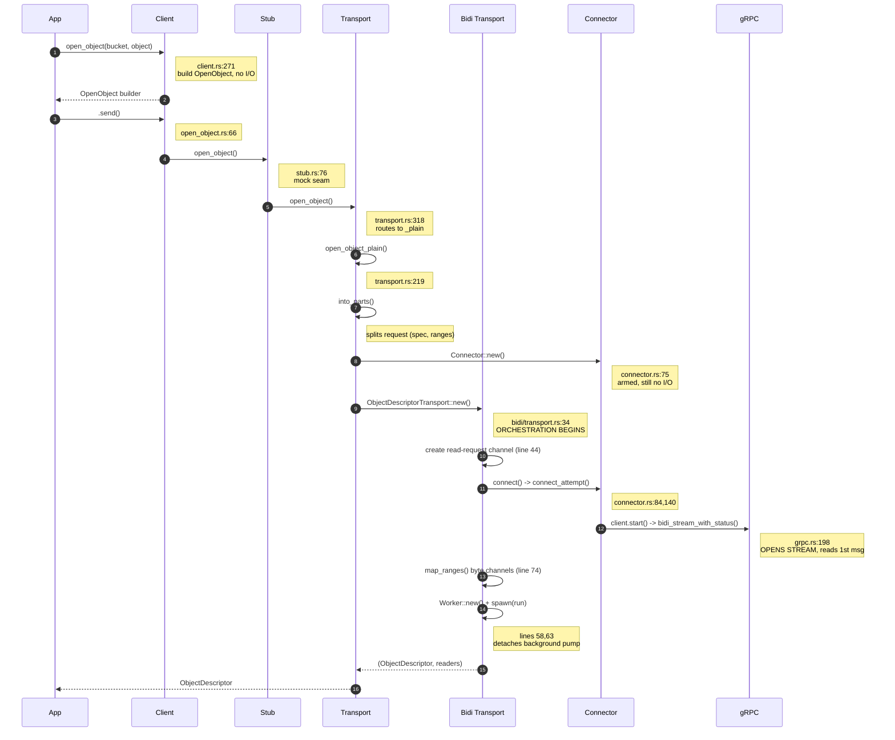
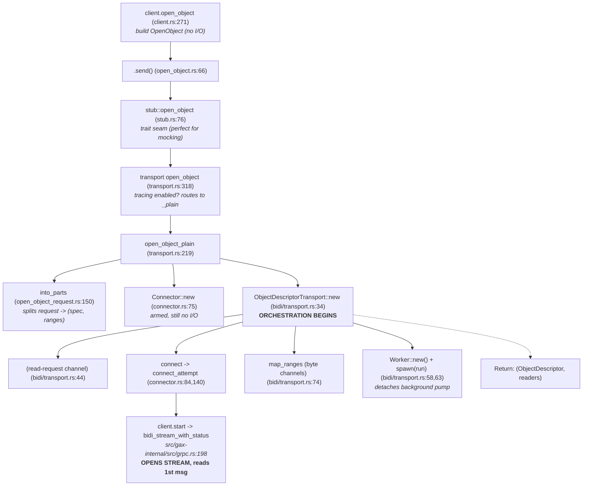

# `open_object` — A Walkthrough

*Last updated: 2026-05-27 (commit 30d28f9a5)*

This guide offers a walkthrough of `Storage::open_object` in the
`google-cloud-storage` crate. We'll look at what it actually does under the
hood, trace through each layer of the stack, see what remains running after the
call returns, and dive deep into reference sections for the trickier components.

All file paths here are relative to the `google-cloud-rust/` repository root,
and any line numbers correspond to the current state of the source code on disk.

## How This Document Was Created

This doc was written with AI assistance.

1. First, I used the following prompt to create an initial draft.

   > I want to understand `open_object`. Starting with a call to
   > `Client::open_object`, trace execution all the way until the function
   > returns. Pay particular attention to `src/storage/bidi` as that where I
   > believe the bulk of the code lies. Ground every citation by annotating
   > every code snippet and claim with file name and line numbers.

1. Next, I asked AI to teach the walkthrough by breaking it down into small,
   conversational chunks. This made it easier to digest the material, and also
   made the job of double checking and challenging the AI much easier. With the
   source code open beside me, I challenged the AI often, asking it to explain,
   substantiate, or revise its claims. Whenever I felt appropriate, I asked the
   AI to update the walkthrough doc with its updated understanding.

1. Once this was done and I had a reasonable understanding of `open_object`, I
   got the AI to clean up its work. I prompted it to clean up its bombastic
   language (e.g. "the spectacle of the `ActiveRead`s operating in perfect
   synchrony with the user-facing `ReadObjectResponse`s is truly a marvel to
   behold" became "the `ActiveRead`s push the newly received chunk of data to
   the corresponding `ReadObjectResponse`"), check its file sources/line
   numbers, tighten its prose, etc. This was done several times, clearing the
   context each iteration. Doing so halved the length of the document.

   I did this by alternating between a "review" prompt:

   > You are an expert in Rust, the google-cloud-rust repository, and a highly
   > skilled technical writer. Here is a document written to understand the
   > `open_object` flow. I suspect that it is poorly written and contains
   > numerous factual inaccuracies. Please read the document tell me all the
   > ways the doc is inaccurate. Check every single code citation rigorously,
   > ensuring the cited line numbers and files are correct. Check whether the
   > document accurately represents the flow. Tell me all the ways the doc
   > misrepresents the code.

   and a "rewriting" prompt:

   > Please rewrite the document so that the language is clean, precise, and
   > direct. Prefer simple sentence structures and clean language.

1. I naively assumed that correcting the AI in conversation would result in it
   saving the corrected knowledge to the document. I was wrong - human review of
   the final was still necessary. To make this task more manageable, the
   document was checked in piecemeal.

## Table of Contents

- [Mental Model: A Persistent Object Handle](#mental-model-a-persistent-object-handle)
- [Files Involved](#files-involved)
- [End-to-End Call Graph](#end-to-end-call-graph)
- [Part 1 - The Linear Execution Trace](#part-1---the-linear-execution-trace)
  - [1. `open_object()` Returns a Request Builder — Lazy, No I/O](#1-open_object-returns-a-request-builder-lazy-no-io)
  - [2. `.send()` / `.send_and_read()`](#2-send-send_and_read)
  - [3. The Stub Trait — The Mock Seam](#3-the-stub-trait-the-mock-seam)
  - [4. The Transport Routes on Tracing](#4-the-transport-routes-on-tracing)
  - [5. `open_object_plain` — Four Crucial Lines](#5-open_object_plain-four-crucial-lines)
  - [6. `into_parts` — Splitting the Request](#6-into_parts-splitting-the-request)
  - [7. `Connector::new` — Armed but Not Fired](#7-connectornew-armed-but-not-fired)
  - [8. `ObjectDescriptorTransport::new` — Orchestration (Part 1: Prep)](#8-objectdescriptortransportnew-orchestration-part-1-prep)
  - [9. `connect()` — The Retry and Self-Heal Loop](#9-connect-the-retry-and-self-heal-loop)
  - [10. `connect_attempt` — Establishing the Connection](#10-connect_attempt-establishing-the-connection)
  - [11. `ObjectDescriptorTransport::new` — Orchestration (Part 2)](#11-objectdescriptortransportnew-orchestration-part-2)
  - [12. The Climb Back Up](#12-the-climb-back-up)
- [Part 2 — Reference and Deep Dives](#part-2--reference-and-deep-dives)
  - [A. The Client Type and the Stub Seam](#a-the-client-type-and-the-stub-seam)
  - [B. `ObjectDescriptor` Anatomy](#b-objectdescriptor-anatomy)
  - [C. The Wire Types](#c-the-wire-types)
  - [D. The Channels](#d-the-channels)
  - [E. The gRPC Transport Layer](#e-the-grpc-transport-layer)
  - [F. Trailers, Status, and Errors](#f-trailers-status-and-errors)
  - [G. `ActiveRead` vs `ReadObjectResponse`](#g-activeread-vs-readobjectresponse)
  - [H. The Two "Metadata"s](#h-the-two-metadatas)
  - [I. The Worker's `run` Loop, Branch by Branch](#i-the-workers-run-loop-branch-by-branch)

## Mental Model: A Persistent Object Handle

`open_object` isn't a one-off "fetch data" request - it opens a **bidirectional
gRPC streaming RPC** (`google.storage.v2.Storage/BidiReadObject`) that enables
concurrent, repeated reads. When the user makes a single call to `open_object`,
here is what happens:

1. **Initiate the connection:** It establishes a single, long-lived
   bidirectional stream to Google Cloud Storage (GCS).
1. **Server responds with object metadata:** The server identifies itself, and
   the very first message it sends back contains the object's metadata.
1. **The stream stays open:** A background **`Worker` task** is spawned to own
   and manage the stream for its entire lifetime.
1. **The user gets a handle:** The user receives an `ObjectDescriptor`, which
   acts as the user's handle. The user can use it to request multiple
   byte-ranges over time, and all these requests are multiplexed over that
   single underlying stream.

In some ways this resembles a pre-cell phone era phone call:

| Metaphor                                     | Real Thing                                                         |
| -------------------------------------------- | ------------------------------------------------------------------ |
| The open line                                | The bidirectional gRPC stream                                      |
| The operator keeping it alive                | The spawned `Worker` task                                          |
| The user's handset wire to the operator      | The **read-request channel** (which carries `ActiveRead` requests) |
| A dedicated answer line per request          | The per-range **byte channels** (which carry `Result<Bytes>`)      |
| The operator's memory of who the user dialed | The `Arc<Mutex<BidiReadObjectSpec>>` (used for redials/reconnects) |
| The handle in the user's hand                | The `ObjectDescriptor`                                             |

By the time `open_object` returns, three distinct things are alive: the gRPC
stream itself, the detached worker task running in the background, and the
user's descriptor handle (which communicates with the worker over a channel).

## Files Involved

Here's a quick map of the relevant files and the layers they represent:

| Layer                                            | File                                                            |
| ------------------------------------------------ | --------------------------------------------------------------- |
| Public client & `open_object` method             | `src/storage/src/storage/client.rs`                             |
| `DefaultStorage` alias                           | `src/storage/src/lib.rs`                                        |
| Request builder (`OpenObject`)                   | `src/storage/src/storage/open_object.rs`                        |
| App request type & `into_parts`                  | `src/storage/src/model_ext/open_object_request.rs`              |
| Stub trait (mock seam)                           | `src/storage/src/storage/stub.rs`                               |
| Default implementation (routing & orchestration) | `src/storage/src/storage/transport.rs`                          |
| Public `ObjectDescriptor`                        | `src/storage/src/object_descriptor.rs`                          |
| Descriptor stub trait & dynamic bridge           | `src/storage/src/storage/bidi/stub.rs`                          |
| Connect and reconnect logic (the real RPC)       | `src/storage/src/storage/bidi/connector.rs`                     |
| Descriptor transport (orchestration)             | `src/storage/src/storage/bidi/transport.rs`                     |
| Background stream pump                           | `src/storage/src/storage/bidi/worker.rs`                        |
| Per-range read state                             | `src/storage/src/storage/bidi/active_read.rs`                   |
| Redirect handling                                | `src/storage/src/storage/bidi/redirect.rs`                      |
| `Client` trait / tonic glue                      | `src/storage/src/storage/bidi.rs`                               |
| Generic gRPC client                              | `src/gax-internal/src/grpc.rs`                                  |
| Generic retry loop                               | `src/gax/src/retry_loop_internal.rs`                            |
| Generated protobufs                              | `src/storage/src/generated/protos/storage/google.storage.v2.rs` |

## End-to-End Call Graph

Here is the high-level execution trace:

| Call Stack / Action                 | Location                           | Description                                   |
| :---------------------------------- | :--------------------------------- | :-------------------------------------------- |
| `client.open_object(b, o)`          | `client.rs:271`                    | build `OpenObject` (no I/O happens here)      |
| -> `.send()`                        | `open_object.rs:66`                | go async, call the stub                       |
| -> `stub::open_object`              | `stub.rs:76`                       | trait seam (perfect for mocking)              |
| -> `transport open_object`          | `transport.rs:318`                 | tracing enabled? -> routes to `_plain`        |
| -> `open_object_plain`              | `transport.rs:219`                 | `into_parts` + `Connector` + `Transport::new` |
| -> `into_parts`                     | `open_object_request.rs:150`       | splits request -> (spec, ranges)              |
| -> `Connector::new`                 | `connector.rs:75`                  | armed, still no I/O                           |
| -> `ObjectDescriptorTransport::new` | `bidi/transport.rs:34`             | **ORCHESTRATION BEGINS**                      |
| -> `(read-request channel)`         | `bidi/transport.rs:44`             |                                               |
| -> `connect` -> `connect_attempt`   | `connector.rs:84,140`              | OPENS STREAM, reads 1st msg                   |
| -> `client.start`                   | `bidi.Connector::connect`          |                                               |
| -> `bidi_stream_with_status`        | `src/gax-internal/src/grpc.rs:198` |                                               |
| -> `inner.streaming`                | `src/gax-internal/src/grpc.rs:223` | \<- tonic / hyper / h2 / socket               |
| -> `map_ranges`                     | `bidi/transport.rs:74`             | creates byte channels                         |
| -> `Worker::new` + `spawn(run)`     | `bidi/transport.rs:58,63`          | detaches background pump                      |
| \<- `(ObjectDescriptor, readers)`   |                                    | Return values                                 |

### Sequence Diagram



### Flowchart



# Part 1 - The Linear Execution Trace

Let's walk through the execution step-by-step.

## 1. `open_object()` Returns a Request Builder — Lazy, No I/O

We start in `client.rs:271`:

```rust
pub fn open_object<B, O>(&self, bucket: B, object: O) -> OpenObject<S>
```

The body of this function is just a single line at `:276`:
`OpenObject::new(self.stub.clone(), bucket, object, self.options.clone())`. It
clones `self.options` so that per-request overrides don't mutate the underlying
client.

Here's the definition of the `OpenObject` struct (`open_object.rs:43`):

```rust
pub struct OpenObject<S = crate::storage::transport::Storage> {
    stub: Arc<S>,
    request: OpenObjectRequest,
    options: RequestOptions,
}
```

(If you are wondering what `S` is, check out **Reference A**.)

The returned `OpenObject` is a request builder which provides the following
setters:

- **Request fields:**
  - `set_generation` (`:142`)
  - `set_if_generation_match` (`:162`)
  - `set_if_generation_not_match` (`:186`)
  - `set_if_metageneration_match` (`:209`)
  - `set_if_metageneration_not_match` (`:232`)
  - `set_key` (`:256`, used for CSEK)
- **Options:** behavior can be configured with:
  - `with_retry_policy` (`:284`)
  - `with_backoff_policy` (`:308`)
  - `with_retry_throttler` (`:338`)
  - `with_read_resume_policy` (`:365`)
  - `with_attempt_timeout` (`:396`, which defaults to 60s)
  - `with_user_agent` (`:415`)
  - `with_quota_project` (`:439`)

Up to this point, there has been zero network activity.

## 2. `.send()` / `.send_and_read()`

The action starts when the user invokes `send()` at `open_object.rs:66`:

```rust
pub async fn send(self) -> Result<ObjectDescriptor> {
    let (descriptor, _) = self.stub.open_object(self.request, self.options).await?;  // :67
    Ok(descriptor)                                                                   // :68
}
```

This method calls the stub—finally initiating network activity—and notably
**discards the `Vec<ReadObjectResponse>` readers** by using `_`.

There's also a sibling method, `send_and_read` (`:91`). This method pushes a
single range first (`:95`) and retains the single reader returned by the stub
(`:98`). It enforces that only one reader exists via `unreachable!` (`:102`).
This is the preferred path for an "open plus first read in a single round trip"
operation.

## 3. The Stub Trait — The Mock Seam

The `open_object` trait method called on the stub is defined in `stub.rs:76`:

```rust
fn open_object(&self, _request, _options)
    -> impl Future<Output = Result<(Descriptor, Vec<ReadObjectResponse>)>> + Send {
    unimplemented_stub::<(Descriptor, Vec<ReadObjectResponse>)>()   // :82 → :104 unimplemented!()
}
```

`self.stub` is typed as `Arc<S: stub::Storage>`. The stub is provided to make it
easier to provide a mock implementation for testing. (See **Reference A** for
more details.)

## 4. The Transport Routes on Tracing

The production trait implementation is located inside `transport.rs:318` (which
is part of `impl super::stub::Storage for Storage`, starting at `:267`):

```rust
async fn open_object(&self, request, options) -> Result<(...)> {
    if self.tracing { return self.open_object_tracing(request, options).await; }  // :323
    self.open_object_plain(request, options).await                                // :326
}
```

If tracing is enabled, `open_object_tracing` (`:231`) wraps the call. It sets up
a `client_request` span tagged with
`google.storage.v2.Storage/BidiStreamingRead` (`:245`), forwards to the `_plain`
variant, and wraps the resulting descriptor and readers with tracing decorators
(`:253–263`). For this walkthrough, we'll follow the `_plain` path.

> ⚠️ *A quick note on naming:* There are two structs named `Storage`. One is the
> **client** `Storage<S>` (`client.rs:92`), and the other is the **transport**
> `Storage` (`transport.rs:49`, which is aliased to `DefaultStorage`). Here,
> `self` refers to the transport.

## 5. `open_object_plain` — Four Crucial Lines

In `transport.rs:219`, the core logic boils down to four lines:

```rust
let (spec, ranges) = request.into_parts();                              // :224  decompose the request into request spec + desired ranges
let connector = Connector::new(spec, options, self.inner.grpc.clone()); // :225  specify the connection parameters
let (transport, readers) =
    ObjectDescriptorTransport::new(connector, ranges).await?;           // :226  establish the connection and send the initial RPC
Ok((ObjectDescriptor::new(transport), readers))                         // :227  wrap the I/O mechanism & return handles to the incoming byte streams
```

Line `:226` is where the network is finally touched.

(Note `self.inner.grpc` references the shared gRPC client attached to
`StorageInner`.)

## 6. `into_parts` — Splitting the Request

Looking at `open_object_request.rs:150`:

```rust
pub(crate) fn into_parts(mut self) -> (BidiReadObjectSpec, Vec<ReadRange>) {
    let ranges = std::mem::take(&mut self.ranges);   // :151
    (BidiReadObjectSpec::from(self), ranges)         // :152
}
```

`std::mem::take` swaps the `ranges` Vec out of the request with any empty Vec,
so that `self` remains whole. This allows `self` to be consumed by `From::from`
on the next line.

(`let ranges = self.ranges` would have resulted in a partial move of `self`,
preventing it from being passed into `BidiReadObjectSpec::from`.)

**Why do we split the request?** The `spec` represents the *connection identity
and conditions* (which are long-lived and resent on every reconnect). The
`ranges` represent the *work* (which is transient; more ranges can be added
later via `read_range`). Consequently, they are routed differently: `spec` goes
to the `Connector` (`:225`), while `ranges` go directly to the transport
(`:226`). This cleanly mirrors the protobuf wire format, where the request
message has distinct `read_object_spec` and `read_ranges` fields (see
**Reference C**).

## 7. `Connector::new` — Armed but Not Fired

In `connector.rs:75`, the connector wraps the `spec` in an `Arc<Mutex<...>>`
(`:77`), stores the options and client, and initializes `reconnect_attempts` to
`0` (`:80`). There's **no I/O** happening here. The struct definition (`:62`)
looks like this:

```rust
pub struct Connector<T = GrpcClient> {
    spec: Arc<Mutex<BidiReadObjectSpec>>,   // mutable, shared identity
    options: RequestOptions,
    client: T,                              // generic for mocking; real = gaxi GrpcClient
    reconnect_attempts: u32,
}
```

The connector's job is: *"Establishes (and reconnects) bidi streaming reads."*
(`:45`).

Handling reconnects inherently requires state. The connector must remember the
generation, read handle, routing token, and the number of attempt counts. We use
an `Arc<Mutex>` because the spec is **mutated** after creation (the server fills
in the generation, handle, and token) and must be **shared** across both the
connect retry loop and the worker's reconnect path.

## 8. `ObjectDescriptorTransport::new` — Orchestration (Part 1: Prep)

Moving to `bidi/transport.rs:34`, we do some prep work before establishing the
connection:

```rust
let (tx, rx) = tokio::sync::mpsc::channel(100);                    // :44  new read request channel
let requested_ranges = ranges.into_iter().map(|r| r.0).collect::<Vec<_>>(); // :45  unwrap newtype
let proto_ranges = requested_ranges.iter().enumerate()
    .map(|(id, r)| r.as_proto(id as i64)).collect::<Vec<_>>();              // :46–50  mint read-ids
```

- **Line `:44`** creates the **read-request channel** between the descriptor and
  the worker. The descriptor holds onto `tx`, while `rx` will be handed to the
  worker (`:63`). This channel carries new read requests (`ActiveRead`).
- **Lines `:46–50`** assign an index to each range, establishing its
  **read-id**. This identifier acts as the address used to reliably route
  responses back to the correct reader. (For a deep dive into all the channels,
  see **Reference D**.)

## 9. `connect()` — The Retry and Self-Heal Loop

Over in `connector.rs:84`, we find `connect()`. It's actually **a wrapper**
around the `connect_attempt` function, rather than the connect operation itself.

Inside, the `inner` closure (`:98`) calculates
`attempt_timeout = min(per-attempt, remaining-budget)` (fulfilling the promise
in the `with_attempt_timeout` docs, at `:99`) and wraps a single
`connect_attempt` in a `tokio::time::timeout`.

The process is driven by `retry_loop` (`:107`): it continuously attempts the
call as long as the retry policy permits, success hasn't been achieved, and the
throttler allows it, sleeping for the appropriate backoff duration between
attempts. The flag `idempotent` is set to `true` (`retry_loop_internal.rs:54`)
because opening a read is safely side-effect-free and retryable. Notably, **this
exact same `connect()` function is reused by the worker whenever a reconnect is
needed (`connector.rs:125`).**

## 10. `connect_attempt` — Establishing the Connection

In `connector.rs:140`, the actual connection is established in two phases.

**Phase A — Composing and sending the opening message:**

```rust
let request = BidiReadObjectRequest {
    read_object_spec: Some((*spec.lock()...).clone()),   // :147  snapshot the request spec
    read_ranges: ranges,                                 // :148
};
// :150–176  validate bucket is `projects/_/buckets/*`, else BindingError BEFORE any network
// :177–183  build x-goog-request-params = bucket=… (+ &routing_token=… if set)
let (tx, rx) = tokio::sync::mpsc::channel::<BidiReadObjectRequest>(100);  // :185  wire-out (mpsc)
tx.send(request.clone()).await...;                                       // :186  preload 1st msg
// :188–197  GrpcMethod + path /google.storage.v2.Storage/BidiReadObject
let response = client.start(extensions, path, rx, options, &X_GOOG_API_CLIENT_HEADER,
                            &x_goog_request_params).await?;              // :199  OPEN THE STREAM
```

Here, `client.start` (`bidi.rs:69`) takes `rx`, wraps it in a `ReceiverStream`,
and invokes `bidi_stream_with_status` (refer to **Reference E**).

Note that if a connection is successfully established, `read_object_spec` is
updated to contain the object's generation and RPC read handle
(`connector.rs:221-226`). `reconnect()` uses `connect()` under the hood, and so
`:147` ensures that any reconnect attempt uses this enriched information.

**Phase B — The Handshake:**

```rust
let response = match response { Ok(r) => r, Err(status) => return Err(handle_redirect(spec, status)) }; // :211
let (metadata, mut stream, _) = response.into_parts();   // :216  metadata=transport headers
let headers = metadata.into_headers();                   // :217
match stream.next_message().await {                      // :218  read the FIRST message
    Ok(Some(m)) => {
        let mut guard = spec.lock()...;                  // :220  ENRICH the spec:
        if let Some(g) = m.metadata.as_ref().map(|o| o.generation) { guard.generation = g; }  // :222
        if m.read_handle.is_some() { guard.read_handle = m.read_handle.clone(); }             // :225
        Ok((m, headers, Connection::new(tx, stream)))    // :227
    }
    Ok(None) => Err(Error::io("...closed before start")), // :229
    Err(status) => Err(handle_redirect(spec, status)),    // :230
}
```

It is required that the first message carries the object metadata (this is
strictly enforced in step 11). The writes at `:222` and `:225` represent the
**enrichment** phase. If the app initiated the request with `generation: 0`
(meaning "latest"), we capture the generation number returned by the server,
alongside the read handle to make future reconnects cheaper.

This block returns `(initial_response, headers, connection)`. This matches
exactly what `connect()` outputs, and what the `connector.connect(...)` call in
step 11 returns.

> *Clarification:* Don't confuse the two uses of the word "metadata" here. The
> first `metadata` that is turned `into_headers` represents the **transport**
> metadata (the gRPC response headers). On the other hand, `m.metadata` is the
> actual **object** metadata (the `Object` protobuf). See **Reference H** for
> details.

## 11. `ObjectDescriptorTransport::new` — Orchestration (Part 2)

Returning to `bidi/transport.rs:51`, armed with our
`(initial, headers, connection)`:

```rust
let (mut initial, headers, connection) = connector.connect(proto_ranges).await?;  // :51
let object = FromProto::cnv(initial.metadata.take().ok_or_else(|| {
    Error::deser("initial response in bidi read must contain object metadata") })?)...;  // :52–55
let object = Arc::new(object);                                                    // :56
let (active, readers) = Self::map_ranges(requested_ranges, &tx, &object);         // :57
let mut worker = super::worker::Worker::new(connector, active);                   // :58
worker.handle_response_success(initial).await.map_err(Error::io)?;                // :59–62
let _handle = tokio::spawn(worker.run(connection, rx));                           // :63
Ok((Self { object, headers, tx }, readers))                                       // :64–71
```

Let's break down this crucial block:

- **Lines `:52–56`:** We use `initial.metadata.take()` - the `Option` equivalent
  of `mem::take` - stealing the field while allowing `initial` to be reused at
  `:59`. We wrap the resulting `Object` in an `Arc` because it needs to be
  shared between the descriptor and every reader.
- **Line `:57`:** `map_ranges` (defined at `:74`, with the per-range channel
  created at `:82`) mints exactly one **byte channel per range**. This yields an
  `ActiveRead` (the sender side, kept by the worker) and a `RangeReader` wrapped
  as a `ReadObjectResponse` (the receiver side, handed to the user). See
  **Reference D** and **Reference G**.
- **Line `:58`:** We instantiate the worker. The `connector` is **moved in**
  here. Because the worker now completely owns the connector, it can freely call
  `connector.reconnect(...)` from within its detached task later on. Inside the
  worker, `active` is transformed into a `HashMap` mapping read ids to
  `ActiveRead`s (`worker.rs:38–43`).
- **Lines `:59–62`:** We immediately feed the worker the first message's
  `object_data_ranges`. This happens **synchronously**. For a standard `send()`,
  this might be a no-op, but for `send_and_read`, it delivers the very first
  chunk of data instantly.
- **Line `:63`:** The worker is handed off to be executed asynchronously via
  `tokio::spawn` and is completely **detached** (we deliberately drop the
  handle). It now has full ownership of the connection and will run its loop
  until the stream concludes naturally, an unrecoverable error strikes, or the
  descriptor's `tx` channel is dropped.
- **Lines `:64–71`:** Finally, we return the fully initialized transport
  (`object`, `headers`, `tx`) along with the `readers`.

## 12. The Climb Back Up

The call stack unwinds cleanly:

| Action                                                           | Location               | Description                                                |
| :--------------------------------------------------------------- | :--------------------- | :--------------------------------------------------------- |
| `ObjectDescriptorTransport::new` -> `(transport, readers)`       | `bidi/transport.rs:64` | Hands the established connection and range readers back up |
| `open_object_plain: ObjectDescriptor::new(transport)`            | `transport.rs:227`     | Wraps the transport stub into the public type              |
| `stub::open_object`                                              | `transport.rs:326`     | Hands the transport stub back up                           |
| **Either:** `.send()`: `let (descriptor, _) = …; Ok(descriptor)` | `open_object.rs:67`    | Discards the readers                                       |
| **Or:** `send_and_read()`                                        | `open_object.rs:98`    | Retains the descriptor plus the single reader              |

The user is now successfully holding an `ObjectDescriptor` (analogous to a file
descriptor) which allows reads on the object.

# Part 2 — Reference and Deep Dives

## A. The Client Type and the Stub Seam

Let's look at `client.rs:92`:

```rust
pub struct Storage<S = crate::stub::DefaultStorage>
where S: crate::stub::Storage + 'static
{ stub: std::sync::Arc<S>, options: RequestOptions }
```

- **`S`** represents the **stub type**—the actual engine that executes the RPCs.
  It is bounded by the `stub::Storage` trait we first saw back in step 3.
- **Default `S = DefaultStorage`**: `DefaultStorage` is simply a handy alias for
  the transport (`pub use crate::storage::transport::Storage as DefaultStorage;`
  in `lib.rs:122`). This means if the user doesn't explicitly specify otherwise,
  `S` resolves to the real network transport (`transport::Storage`).
- **Why make it generic?** It's all about testing. The user can instantiate
  `Storage<MockStub>` to exercise the entire client chain against a mocked
  backend. The `from_stub` method (`client.rs:130`) exists explicitly for this
  purpose. Since `S` is a type parameter rather than a `dyn` trait object,
  method dispatch remains **static**—no virtual table overhead.

To use an analogy: if `open_object` is the act of placing a phone call, the
`stub` is the phone itself. In production, the user has a real phone wired
directly to GCS. In tests, the user swaps it for a toy phone that plays
pre-recorded responses.

## B. `ObjectDescriptor` Anatomy

The `object_descriptor.rs` file defines the public handle the user receives.
Structurally, it's a **hollow newtype wrapped around a trait object** (`:58`):

```rust
pub struct ObjectDescriptor { inner: Arc<dyn ObjectDescriptorStub> }
```

- `Arc` ensures it is cheap to `Clone`. If the user clones the descriptor, both
  copies share the same underlying open stream and worker task.
- `dyn` enables type erasure, letting the same handle wrap either the real
  transport or a mock implementation.
- The three methods exposed to the user—`object()` (`:79`), `read_range()`
  (`:112`), and `headers()` (`:133`)—simply forward their calls directly to
  `self.inner`. All the real behavioral logic lives inside the inner
  `ObjectDescriptorTransport`.
- The `new<T>` constructor (`:141`) takes any type `T: stub::ObjectDescriptor`
  and wraps it in the `Arc<dyn>`. Conversely, `into_parts` (`:150`) extracts and
  returns the raw `inner` object (which is how the tracing path unpacks it).

There are some excellent documentation notes at `:44–56`: the handle is
described as being *"analogous to a 'file descriptor'"*. It warns that reads
across different ranges have **no ordering guarantees**. Crucially, it
highlights a major footgun: if the user fails to drain data from one reader, its
buffer will fill up, which will **stall all other reads** sharing the stream.

Is `ObjectDescriptor` truly like a file descriptor? Yes, specifically one of the
**`pread` flavor**: the user opens it once, and then the user can issue multiple
positional `(offset, length)` reads. There is no internal seek pointer, and
dropping the descriptor is effectively closing it (as seen in `worker.rs:88`,
where the worker gracefully exits when the descriptor's `tx` channel
disappears). But it's also *more* powerful than a simple file descriptor: it
caches metadata in-process (`object()` doesn't require an I/O call), it is
**snapshot-pinned** to a specific object generation (`connector.rs:221`), and it
intelligently **self-heals** by reconnecting under the hood (`worker.rs:153`).

**The Two-Trait Pattern:** The user might notice that the trait used in the
`inner` field type (`:21`, `:59`) differs slightly from the trait bound on
`new<T>` (`:143`). Here is why:

- `crate::stub::ObjectDescriptor` (`stub.rs:92`): This is the **ergonomic**
  trait featuring native `async fn`. However, native async traits aren't
  dyn-compatible (object safe).
- `...bidi::stub::dynamic::ObjectDescriptor` (`bidi/stub.rs:24`): This is the
  **dyn-safe** variant, utilizing `#[async_trait]` to return boxed futures. This
  is what actually gets stored inside the `Arc<dyn>`.
- The bridge: At `bidi/stub.rs:31`, a blanket implementation automatically
  implements the dyn-safe trait for any type `T` that implements the ergonomic
  `stub::ObjectDescriptor`. This means implementors get the clean, modern API,
  while the library handles the messy type erasure internally.

## C. The Wire Types

Let's look at the data structures carrying the requests and responses.

**`OpenObjectRequest`** (`open_object_request.rs:30`): This is the user-friendly
container built by the application. It holds the bucket, object name,
generation, the four `if_*` preconditions, CSEK parameters, and the initial
`ranges`. It deliberately **omits** the `read_handle` and `routing_token` (as
noted in the comment at `:26`), because those values are strictly supplied by
the server.

**`BidiReadObjectSpec`** (`google.storage.v2.rs:410`): This is the generated
protobuf type representing the "which object and under what conditions" half of
the request. The fields can be grouped by where they originate:

- *App-supplied:*
  - `bucket` (`:412`)
  - `object` (`:414`)
  - `generation` (`:416`)
  - the four `if_*` conditions:
    - `if_generation_match` (`:418`)
    - `if_generation_not_match` (`:420`)
    - `if_metageneration_match` (`:422`)
    - `if_metageneration_not_match` (`:424`)
  - `common_object_request_params` (`:426`)
- *Server-supplied (filled in by the connector):*
  - `read_handle` (`:431`)
  - `routing_token` (`:433`)
- The `read_mask` field (`:429`) is marked `#[deprecated]`.
- The `generation` field actually switches ownership: it starts as the
  application's request (e.g., `0` for "latest"), but the connector overwrites
  it with the concrete value resolved by the server (`connector.rs:221`),
  effectively pinning the snapshot.

A note on the `#[prost(...)]` decoder: `tag = "N"` represents the wire field
number (names aren't transmitted, and tags may have gaps if fields were
deprecated). `Option<T>` maps to the protobuf `optional` keyword, distinguishing
an intentionally "unset" value from a literal `0`.

**`BidiReadObjectRequest`** (`:446`): This is the payload sent by the client
over the stream:

```rust
pub struct BidiReadObjectRequest {
    /// Sent exactly once per connection.
    /// Subsequent messages omit this.
    /// Resent during a reconnect.
    pub read_object_spec: Option<BidiReadObjectSpec>,
    /// The ranges to read; the user can ask for any number of chunks at any time.
    pub read_ranges: Vec<ReadRange>,
}
```

The data shape encodes the **streaming grammar**: the spec is an `Option` since
the user sends it **only once** per connection (the first message has `Some`,
subsequent ones send `None`, as seen in `worker.rs:204`; a reconnect will
re-send the enriched spec). The ranges are `repeated`, meaning the user can ask
for any number of chunks at any time.

**`BidiReadObjectResponse`** (`:463`): This is what the server streams back to
the client:

```rust
pub struct BidiReadObjectResponse {
    /// The raw bytes, tagged by their read-id.
    pub object_data_ranges: Vec<ObjectRangeData>,
    /// Object metadata.
    pub metadata: Option<Object>,
    /// A token returned by the server to identify the open read session;
    /// the client passes this back during reconnects to resume the stream.
    pub read_handle: Option<BidiReadHandle>,
}
```

## D. The Channels

The implementation uses multiple sender-receiver channel pairs.

| Name                                   | Carries                  | Direction            | Created At                            | `tx` Held By                                 | `rx` Held By                                | Purpose                                                                    |
| -------------------------------------- | ------------------------ | -------------------- | ------------------------------------- | -------------------------------------------- | ------------------------------------------- | -------------------------------------------------------------------------- |
| **Read-Request Channel**               | `ActiveRead`             | descriptor -> worker | `bidi/transport.rs:44`                | descriptor (`Self.tx`) + each reader (clone) | worker (`requests`)                         | Carries new `ActiveRead` intents from user code to the worker task.        |
| **Byte Channels** (one per read range) | `Result<Bytes>`          | worker -> one reader | `bidi/transport.rs:82` and `:100`     | worker (inside each `ActiveRead`)            | that specific reader (`RangeReader`)        | Data path delivering the raw object bytes back to a specific range reader. |
| **Wire-Out**                           | `BidiReadObjectRequest`  | client -> server     | `connector.rs:185` (preloaded `:186`) | worker (`Connection.tx`)                     | gRPC (as the request stream)                | Outbound network stream sending gRPC requests to the GCS server.           |
| **Wire-In**                            | `BidiReadObjectResponse` | server -> client     | returned from `client.start`          | n/a (managed by tonic)                       | worker (`Connection.rx`, tonic `Streaming`) | Inbound network stream receiving gRPC responses from the GCS server.       |

### Detailed Breakdown per Channel

#### 1. Read-Request Channel (Descriptor -> Worker)

| Property         | Detail                                                                                                                                                                                                                                           |
| :--------------- | :----------------------------------------------------------------------------------------------------------------------------------------------------------------------------------------------------------------------------------------------- |
| **Type**         | `tokio::sync::mpsc::Sender<ActiveRead>` / `tokio::sync::mpsc::Receiver<ActiveRead>`                                                                                                                                                              |
| **Created**      | `bidi/transport.rs:44`, with a capacity of `100`.                                                                                                                                                                                                |
| **`tx` Held By** | The `ObjectDescriptorTransport` (as its `tx` field) and cloned into each `RangeReader`.                                                                                                                                                          |
| **`rx` Held By** | The worker task, held locally inside `run` (named `requests`).                                                                                                                                                                                   |
| **Purpose**      | Whenever `descriptor.read_range(...)` is called, it pushes a new `ActiveRead` onto this channel. Branch B of the worker's `run` loop drains it via `recv_many`.                                                                                  |
| **Lifetime**     | Exactly one exists per `open_object` call. It lives as long as the descriptor itself or any active reader remains. When all `Sender` clones are dropped, Branch B observes `r == 0` (`bidi/worker.rs:89`), signaling the worker to exit cleanly. |

#### 2. Byte Channels (Worker -> Reader, One *Per Range*)

| Property         | Detail                                                                                                                                                                                                                                              |
| :--------------- | :-------------------------------------------------------------------------------------------------------------------------------------------------------------------------------------------------------------------------------------------------- |
| **Type**         | `tokio::sync::mpsc::Sender<ReadResult<Bytes>>` / `tokio::sync::mpsc::Receiver<ReadResult<Bytes>>`                                                                                                                                                   |
| **Created**      | `bidi/transport.rs:82` inside `map_ranges` (for ranges established during connection) and at `bidi/transport.rs:100` for post-open `read_range` calls. Capacity is `100`.                                                                           |
| **`tx` Held By** | The `ActiveRead` corresponding to that specific range (stored in the worker's `self.ranges` HashMap).                                                                                                                                               |
| **`rx` Held By** | The `RangeReader` for that range (wrapped inside the `ReadObjectResponse` returned to the user).                                                                                                                                                    |
| **Purpose**      | When the worker receives object data from the server tagged with a specific read-id, it looks up the corresponding `ActiveRead` in its HashMap and pushes the bytes into that range's byte channel. The reader extracts them by awaiting `.next()`. |
| **Lifetime**     | One exists per active range. A `send_and_read(N)` call creates `N` byte channels. Every subsequent call to `read_range` adds one more.                                                                                                              |

#### 3. Wire-Out (Worker -> Tonic -> Server)

| Property         | Detail                                                                                                                                                                                                                                                                                             |
| :--------------- | :------------------------------------------------------------------------------------------------------------------------------------------------------------------------------------------------------------------------------------------------------------------------------------------------- |
| **Type**         | `tokio::sync::mpsc::Sender<BidiReadObjectRequest>` / `tokio::sync::mpsc::Receiver<BidiReadObjectRequest>`                                                                                                                                                                                          |
| **Created**      | `connector.rs:185` (and preloaded at `:186`) during `connect_attempt`, with a capacity of `100`.                                                                                                                                                                                                   |
| **`tx` Held By** | The worker (stored in `Connection.tx`, unpacked into a local `tx` variable in `run`).                                                                                                                                                                                                              |
| **`rx` Held By** | Tonic, after being wrapped in a `ReceiverStream` and passed into `inner.streaming(...)` (`src/gax-internal/src/grpc.rs:198`).                                                                                                                                                                      |
| **Purpose**      | The worker pushes outbound `BidiReadObjectRequest` messages here. Tonic drains the receiver, serializes the messages with Prost, frames them, and pushes them down onto the HTTP/2 socket.                                                                                                         |
| **Lifetime**     | **One per connection attempt.** Whenever a reconnect occurs, a brand new pair is created, and the old one is discarded. (The opening message is preloaded via `tx.send(request.clone()).await` before the stream even starts, guaranteeing the server sees the spec on the very first DATA frame.) |

#### 4. Wire-In (Server -> Tonic -> Worker)

| Property          | Detail                                                                                                                                                                                                               |
| :---------------- | :------------------------------------------------------------------------------------------------------------------------------------------------------------------------------------------------------------------- |
| **Type**          | `tonic::Streaming<BidiReadObjectResponse>` (Note: this is tonic's custom stream type, not an mpsc pair, exposed via the `TonicStreaming` trait at `bidi.rs:38–49` for mockability).                                  |
| **Created**       | Returned directly from `inner.streaming(...)` (`src/gax-internal/src/grpc.rs:223`) and exposed via the `Connection` struct.                                                                                          |
| **Producer Side** | Owned and managed internally by Tonic as it buffers incoming HTTP/2 DATA frames.                                                                                                                                     |
| **Consumer Side** | Held by the worker (in `Connection.rx`, unpacked locally in `run`).                                                                                                                                                  |
| **Purpose**       | Branch A of the worker's loop calls `rx.next_message()` to pull responses one by one. It can return `Ok(Some(response))`, `Ok(None)` for a clean termination, or `Err(status)` for an error or a severed connection. |
| **Lifetime**      | **One per connection attempt.** A new connection guarantees a new wire-in stream.                                                                                                                                    |

### Counts at a Glance

If the user runs a `send_and_read` requesting `N` initial ranges on the very
first connection:

| Channel Type         | Count                                    | Survives Reconnect?                |
| -------------------- | ---------------------------------------- | ---------------------------------- |
| Read-Request Channel | 1                                        | Yes, survives without interruption |
| Byte Channels        | `N` (one for each range)                 | Yes, survive without interruption  |
| Wire-Out             | 1                                        | No, replaced entirely              |
| Wire-In              | 1 (technically a tonic stream, not mpsc) | No, replaced entirely              |

Every new `read_range` call adds precisely one new byte channel, leaving the
other counts unchanged. If the network drops and the worker successfully
reconnects, the user-facing read-request and byte channels survive without
interruption, while the wire-in and wire-out conduits are replaced entirely. In
other words, when a reconnect happens, only the network side gets rebuilt.

### The Overarching Pattern

- **Read-Request Channel:** The command path from "user code to worker."
- **Byte Channels:** The data path from "worker back to user code."
- **Wire-Out / Wire-In:** The transient network links managed via Tonic, totally
  disposable during a reconnect.

**Disambiguating the multiple `tx, rx` pairs in `map_ranges`:** At
`bidi/transport.rs:57`, the code passes `&tx` (the sender for the read-request
channel) into the function. The signature renames it to `requests` (`:76`).
Then, at `:82`, it creates a *new* channel `(tx, rx)` for the bytes, reusing the
exact same variable names. Consequently, inside the closure, `requests` is the
read-request sender (which gets cloned into each reader), and the new `tx` is
the byte channel sender (which is handed to the `ActiveRead`).

**Who holds what afterward:**

- **Descriptor:** The read-request channel `tx` (plus `object` and `headers`).
- **Worker:** The read-request channel `rx` (listening for new intents), the
  wire-out `tx` and wire-in stream (talking to the server), and a byte channel
  `tx` tucked inside each `ActiveRead` (pushing bytes to readers). Inside
  `worker.run` (`worker.rs:65`), the connection is destructured into `rx` and
  `tx`, again reusing the names.
- **Each Reader:** Its dedicated byte channel `rx` (to receive bytes) and a
  clone of the read-request channel `tx` (to poke the worker).

## E. The gRPC Transport Layer

The function `client.start` (`bidi.rs:69`) wraps the outbound `rx` channel into
a `ReceiverStream` and invokes `bidi_stream_with_status`
(`src/gax-internal/src/grpc.rs:198`). Let's peek inside:

| Source / Line                              | Expression / Call               | Description / Comment                     |
| :----------------------------------------- | :------------------------------ | :---------------------------------------- |
| `src/gax-internal/src/grpc.rs:212 -> :555` | `make_headers(…)`               | user-agent, x-goog-user-project, etc.     |
| `src/gax-internal/src/grpc.rs:213 -> :539` | `add_auth_headers(headers)`     | fetches the Bearer token                  |
| `src/gax-internal/src/grpc.rs:214`         | `MetadataMap::from_headers(…)`  | converts HTTP headers to gRPC metadata    |
| `src/gax-internal/src/grpc.rs:215`         | `tonic::Request::from_parts(…)` | packages metadata and the outbound STREAM |
| `src/gax-internal/src/grpc.rs:216`         | `ProstCodec::default()`         | the protobuf serializer/deserializer      |
| `src/gax-internal/src/grpc.rs:217`         | `self.inner.clone()`            | the underlying Tonic InnerClient at :71   |
| `src/gax-internal/src/grpc.rs:218`         | `inner.ready().await`           | waits for channel readiness               |
| `src/gax-internal/src/grpc.rs:223`         | `inner.streaming(req, path, …)` | **THE ACTUAL TONIC BIDI CALL**            |
| `src/gax-internal/src/grpc.rs:231`         | `Ok(result)`                    | returns the result                        |

Below `:223`, everything descends into the lower layers: Tonic -> Hyper ->
HTTP/2 -> raw socket.

**The Double `Result`:** Line `src/gax-internal/src/grpc.rs:206` returns
`Result<tonic::Result<…>>`.

- The **outer** result represents GAX-level errors (setup failures, header
  issues, auth errors, `ready` checks), propagated via `?`.
- The **inner** `tonic::Result` (which is `Result<_, tonic::Status>`) represents
  the actual outcome of the gRPC call.

While `bidi_stream` (`:168`) eagerly flattens the inner error using
`to_gax_error` (`:190`), `bidi_stream_with_status` deliberately preserves the
raw `Status`. This is crucial because **the Storage layer needs to extract
redirect details directly from the Status** (as documented at `:195–197`). so
that `connect_attempt` can gracefully handle `Err(status) -> handle_redirect`
(`connector.rs:211/230`).

## F. Trailers, Status, and Errors

gRPC trailers (such as `grpc-status`, `grpc-message`, and
`grpc-status-details-bin`) arrive **after** the message body. This
implementation never reads them as a raw metadata map; instead, they surface as
the **terminal result when reading the stream**.

Calling `next_message` (`bidi.rs:46`) invokes Tonic's `message()`, returning a
`Result<Option<T>, Status>`:

- `Ok(Some(msg))`: A normal data message (we're still inside the body).
- `Ok(None)`: A clean termination; the trailers reported `grpc-status: OK`.
- `Err(status)`: This indicates either an error trailer **or** a prematurely
  severed connection (Tonic synthesizes a `Status` for the latter). Because both
  scenarios look identical, the worker simply treats any `Err` by triggering a
  reconnect (`worker.rs:116`).

The user can parse the type signature as answering two questions: `Result` asks
"Did it end okay, or error?", while `Option` asks "Is there more data, or are we
done?".

The status's **details** (derived from the `grpc-status-details-bin` trailer)
are highly relevant. Tonic decodes them into `Status::details()`, and
`handle_redirect` (`redirect.rs:25`) uses Prost to decode them, extracting the
routing token and read handle into the spec (`:30–31`). Thus, trailer-borne
redirect payloads are the primary driver of reconnect routing.

**How the status reaches the user:** The function `to_gax_error` (imported from
`gaxi::grpc::from_status` at `redirect.rs:19` and called at `redirect.rs:36`)
converts the `tonic::Status` into a standard `gax::Error`, which `send()`
eventually returns. The user inspects this by reading `err.status().code` (for
example, the `open_object` test asserts that `s.code == Code::NotFound` at
`transport.rs:528`).

**Manually inspecting trailing metadata:** this is not currently not done
because the codebase only cares about the status. If this is desired the user
would need to completely drain the body until `Ok(None)` and then invoke Tonic's
`Streaming::trailers()`. To implement it, the user would add a `trailers()`
method to the `TonicStreaming` trait (`bidi.rs:38`) and call it on the
clean-exit path after the worker's loop terminates (`worker.rs:74`/`:96`), while
`rx` is still fully owned.

## G. `ActiveRead` vs `ReadObjectResponse`

These are simply the two opposite ends of a single range's **byte channel**,
created in `map_range` (`transport.rs:93`) and `read_range`
(`transport.rs:113`).

**`ActiveRead`** (`active_read.rs:25`) is the **worker's** write-end and routes
data received over the network to its `ReadObjectResponse` counterpart.

```rust
pub(crate) struct ActiveRead {
    state: RemainingRange,                       // tracks how much of the range remains
    sender: Sender<ReadResult<bytes::Bytes>>,    // the WRITE end of the channel
}
```

- `handle_data` (`:41`): When a chunk arrives, it updates `state`, **verifies
  the crc32c checksum** (`:52–60`), and pushes the bytes.
- `as_proto(id)` (`:77`): Generates a proto range describing only the
  *remaining* bytes, ensuring a reconnect only asks for what hasn't been
  received yet (`active_read.rs:77`).
- `interrupted(error)` (`:67`): Pushes a terminal `Err` down the channel to
  intentionally fail the reader.

**`ReadObjectResponse`** (which wraps a `RangeReader`) is **the user's**
read-end. It simply holds the `Receiver`, yields sequential chunks via
`.next().await`, and contains no complex logic.

Because the channel inherently carries `Result<Bytes, ReadError>`, errors share
the exact same conduit as data. Thus, `reader.next().await` yields an
`Option<Result<Bytes>>` (`Some(Ok)` means a chunk, `Some(Err)` means failure,
and `None` means done). This is why, in
[step 11 of Part 1](#11-objectdescriptortransportnew-orchestration-part-2), the
`active` half is given to the worker while the `readers` half is handed back to
the user.

## H. The Two "Metadata"s

During the handshake inside `connect_attempt`, two distinct concepts are
confusingly both referred to as "metadata" just lines apart:

|                    | `headers` (`connector.rs:216`)                                        | `m.metadata` (`connector.rs:221`)          |
| ------------------ | --------------------------------------------------------------------- | ------------------------------------------ |
| **What it is**     | gRPC **response headers** (gRPC confusingly calls headers "metadata") | The **object's** actual storage properties |
| **Type**           | `MetadataMap` -> `HeaderMap`                                          | `Option<Object>`                           |
| **Extracted From** | The response **envelope** (head)                                      | The very first **body message**            |
| **Becomes**        | `descriptor.headers()`                                                | `descriptor.object()`                      |
| **Example**        | `content-type: application/grpc`, `x-guploader-uploadid`              | `generation: 123456`, `size: 42`           |

Think of it like an HTTP response: the envelope/headers represent transport
metadata wrapping the call itself, while the body carries the message stream.
The very first chunk in that body happens to carry the object's storage metadata
inside a field literally named `metadata`.

## I. The Worker's `run` Loop, Branch by Branch

At `worker.rs:59`, after `Worker::new` initializes everything and the first
message is processed via `handle_response_success`, the worker is launched in
the background via `tokio::spawn(worker.run(connection, rx))`
(`bidi/transport.rs:63`). The `run` method functions as the perpetual background
pump.

### Skeleton of the Loop

```rust
pub async fn run(mut self, connection: Connection<C::Stream>, mut requests: Receiver<ActiveRead>) -> LoopResult<()> {
    let mut ranges = Vec::new();
    let (mut rx, mut tx) = (connection.rx, connection.tx);    // wire-in and wire-out
    let error = loop {
        tokio::select! {
            m = rx.next_message() => { ... }                   // :71  Branch A — Inbound
            r = requests.recv_many(&mut ranges, 16) => { ... } // :88  Branch B — Outbound
        }
    };
    drop(rx); drop(tx);
    let Some(e) = error else { return Ok(()); };
    while let Some(mut r) = requests.recv().await { ... }      // drain any straggling readers
    Err(e)
}
```

The `tokio::select!` macro races both arms every single iteration, running
whichever resolves first. Since it runs in a single task, only one arm executes
per iteration (there is no parallel execution inside the worker). The internal
`loop` acts as an expression: whatever value it `break`s with gets assigned to
`error`, which the post-loop cleanup code evaluates.

There are three exit paths:

- `break None`: A clean shutdown (the loop yields `None`).
- `break Some(e)`: A fatal error occurred.
- No break: Keep looping indefinitely.

After breaking, a clean exit returns `Ok(())`. An error exit aggressively drains
any pending `read_range` calls that were queued too late, failing them all via
`r.interrupted(e.clone())` before returning `Err(e)`.

### Branch A — Inbound (Wire-In -> Routing / Reconnect)

Located at `worker.rs:71–87`:

```rust
m = rx.next_message() => {
    match self.handle_response(m).await {
        None => break None,
        Some(Err(e)) => break Some(e),
        Some(Ok(None)) => {},
        Some(Ok(Some(connection))) => {
            (rx, tx) = (connection.rx, connection.tx);
        }
    };
},
```

**`rx.next_message()`** is bound to the `TonicStreaming` trait
(`bidi.rs:38–48`), which exists primarily to facilitate mocking. In production,
it wraps Tonic's `Streaming::message()` in one line. One call strictly yields
one message, not a batch.

It returns `Result<Option<BidiReadObjectResponse>, tonic::Status>`, encoding
three states:

- `Ok(Some(response))` — a healthy data message.
- `Ok(None)` — a clean stream termination.
- `Err(status)` — a stream error (could be an error trailer or a broken socket,
  both synthesized into a `Status` by Tonic).

**`handle_response` and the `transpose()?` Trick** (`worker.rs:110–122`):

```rust
pub async fn handle_response(
    &mut self,
    message: TonicResult<Option<BidiReadObjectResponse>>,
) -> Option<LoopResult<Option<Connection<C::Stream>>>> {
    let response = match message.transpose()? {
        Ok(r) => r,
        Err(status) => return self.reconnect(status).await,
    };
    match self.handle_response_success(response).await {
        Err(e) => Some(Err(e)),
        Ok(_) => Some(Ok(None)),
    }
}
```

`message.transpose()` flips `Result<Option<T>, E>` into `Option<Result<T, E>>`.
The trailing `?` unwraps the outer `Option`. If it encounters a `None`
(representing an `Ok(None)` clean stream end), it early-returns `None` out of
`handle_response`, which the run loop intercepts with its `None => break None`
arm.

If it receives `Err(status)`, it immediately routes to
`self.reconnect(status).await`. If it gets `Ok(Some(r))`, it passes it down to
`self.handle_response_success(r).await`.

`handle_response_success` (`:124`) hands off to `handle_ranges`, which loops
over `handle_range_data` to route bytes via the `self.ranges` HashMap into the
correct byte channel. Routing failure yields `Some(Err(e))` (triggering a fatal
`break Some(e)` in the run loop), while success yields `Some(Ok(None))`
(instructing the run loop to continue using the same connection).

The `reconnect` method (`:153`) iterates over every range in `self.ranges` and
executes `self.connector.reconnect(status, ranges)`. If the reconnect outright
fails, it yields a fatal `Some(Err(e))`. If it succeeds, it returns
`Some(Ok(Some(new_connection)))`, signaling the run loop to swap in the new wire
pair.

**The Four Match Arms in the Run Loop:**

| Arm                          | Meaning                                         | Action                            |
| ---------------------------- | ----------------------------------------------- | --------------------------------- |
| `None`                       | Clean termination of stream                     | `break None` — exit with success  |
| `Some(Err(e))`               | Fatal (corrupt data or total reconnect failure) | `break Some(e)` — exit with error |
| `Some(Ok(None))`             | Message routed successfully, connection healthy | fall through, continue loop       |
| `Some(Ok(Some(connection)))` | Reconnect succeeded, entirely new wire pair     | update `rx`/`tx`, continue loop   |

**The Reconnect Swap:**

```rust
(rx, tx) = (connection.rx, connection.tx);
```

Using destructuring assignment, both wire halves are atomically replaced in a
single line. On the next iteration, `rx.next_message()` reads from the new
stream, and `tx.clone()` uses the new sender.

### Branch B — Outbound (Read-Request Channel -> Wire-Out)

Located at `worker.rs:88–93`:

```rust
r = requests.recv_many(&mut ranges, 16) => {
    if r == 0 {
        break None;
    };
    self.insert_ranges(tx.clone(), std::mem::take(&mut ranges)).await;
},
```

**Understanding `recv_many`:** This performs a batched receive. There are two
distinct buffers at play here:

- The **channel's internal queue** (capacity `100`, configured at
  `bidi/transport.rs:44`). Senders continuously push into this queue while the
  worker is busy executing other tasks.
- The **Vec scratch buffer named `ranges`** (declared at `worker.rs:64`), passed
  here via mutable reference (`&mut`).

`recv_many(buf, max)` blocks until the queue holds at least one item, then
eagerly drains *up to* `max` items from the queue directly into `buf`, returning
the total count. If seven `read_range` calls queue up while the worker is busy
on Branch A, Branch B drains all seven simultaneously on its next pass. This
keeps latency low for the first item while boosting overall throughput.

The limit `16` restricts the drain count per cycle to keep the loop responsive
to incoming network data (Branch A). The `100` is the channel capacity,
providing backpressure headroom. These are parameters that can be tuned.

**`r == 0` — Graceful Shutdown:** This only evaluates to true when the channel
is **closed *and* empty**—meaning every single `Sender<ActiveRead>` clone has
been dropped *and* the internal queue is drained. Those clones reside in the
descriptor (`Self.tx`) and inside every `RangeReader` (`requests.clone()` at
`bidi/transport.rs:84`). Thus, this condition only triggers when the descriptor
and all active readers are destroyed. `break None` then exits the loop cleanly.
(A temporary lull in requests simply causes `recv_many` to sleep; it does *not*
return 0).

**Understanding `mem::take(&mut ranges)` (`worker.rs:92`)**:

`mem::take` functionally acts as `mem::replace(&mut v, T::default())`:

- It extracts and returns the current filled Vec.
- It leaves a brand new `T::default()` (which for a Vec is `Vec::new()`, a
  zero-capacity, allocation-free shell) in the slot.

It does **not** preserve the allocation between iterations. The memory
allocation rides along with the returned Vec into `insert_ranges` and is
deallocated when that Vec goes out of scope. The next iteration's `recv_many`
starts completely fresh with a zero-capacity Vec.

The reason for using `mem::take` here is **borrow-checker hygiene**. The
variable `ranges` must survive across the loop because the `recv_many` future
actively borrows `&mut ranges` each iteration. Moving the Vec out directly
(`insert_ranges(.., ranges)`) would leave the variable in an invalid, moved-from
state. `mem::take` safely swaps a fresh default in, satisfying the compiler in a
single expression.

**`tx.clone()` (`worker.rs:92`) Sidestepping Borrow Constraints:** Passing a
clone into `insert_ranges` allows that function to execute `.send(..).await`
without retaining a borrow of the outer `tx` variable across an `.await`
boundary. The worker's primary `tx` survives safely in the main `run` scope for
the next loop.

**Inside `insert_ranges` (`worker.rs:194–214`):**

```rust
async fn insert_ranges(&mut self, tx: Sender<BidiReadObjectRequest>, readers: Vec<ActiveRead>) {
    let mut ranges = Vec::new();                  // local proto buffer (distinct from outer `ranges`!)
    for r in readers {
        let id = self.next_range_id;              // :197  mint a fresh, monotonic id
        self.next_range_id += 1;
        let request = r.as_proto(id);             // :200  generate the proto for the *remaining* range
        self.ranges.lock().await.insert(id, r);   // :201  register the ActiveRead in the routing HashMap
        ranges.push(request);                     // :202  append the range proto to the outgoing wire message
    }
    let request = BidiReadObjectRequest {
        read_ranges: ranges,
        ..BidiReadObjectRequest::default()        // spec: None — it was already sent
    };
    if let Err(e) = tx.send(request).await {      // :211  ship it; failure is non-fatal
        tracing::error!("error sending read range request: {e:?}");
    }
}
```

For every single `ActiveRead`:

1. **Mint a fresh id.** `self.next_range_id` increments monotonically; ids are
   never reused over the worker's life. No atomics are required since
   `&mut self` provides exclusive access.
1. **Build the proto.** `r.as_proto(id)` extracts the read's current
   `RemainingRange`, meaning reconnects re-request only unreceived bytes
   (`active_read.rs:77`).
1. **Register in the HashMap.** Acquiring the `tokio::sync::Mutex`
   (`self.ranges.lock().await.insert(id, r)`) moves `r` into the routing table
   under its `id`, releasing the lock immediately at statement end.
1. **Collect the proto** into `ranges`.

After processing the loop, all protos are batched into a single
`BidiReadObjectRequest`. The `..BidiReadObjectRequest::default()` syntax fills
the remaining fields, most importantly setting `read_object_spec: None` - the
spec is only sent during the initial handshake or a full reconnect.

**Insert-Before-Send is the Design Hinge.** Crucially, the HashMap insert
(`:201`) happens *before* the `tx.send` (`:211`). If the send succeeds, the
routing is already prepped. If the send fails (because the wire-out is dead),
the entry safely *remains* in the HashMap. Branch A is on the verge of noticing
the dead connection and will trigger `reconnect` (`worker.rs:153`), which
systematically scoops up every range from the HashMap (`:157–163`) and
forcefully re-requests them in the new connection's opening message. Thus,
`tx.send` failures are intentionally logged and ignored; the robust reconnect
path catches them.

The governing pattern: **The HashMap is durable; the network wire is
disposable.** Reads secure a spot in the HashMap first, wire delivery is
inherently best-effort, and reconnect logic re-sends anything the network
dropped. No read is ever lost.

### The Inbound Pipeline in Depth

Here's what happens when Branch A receives a successful message:

```
rx.next_message()        ->  handle_response(m)
                                 |
                                 v (Ok(Some(r)))
                            handle_response_success(r)
                                 |
                                 v
                            handle_ranges(data)
                                 |
                                 v (for each chunk)
                            handle_range_data(ranges, chunk)
                                 |
                                 v
                            ActiveRead::handle_data  ->  Handler::send  (lock-free)
```

On an `Err(status)`, it detours to `reconnect`, which might invoke
`close_readers` if the reconnect fails entirely.

#### `handle_response_success` (worker.rs:124)

```rust
pub async fn handle_response_success(
    &mut self,
    response: BidiReadObjectResponse,
) -> LoopResult<()> {
    if let Err(e) = self.handle_ranges(response.object_data_ranges).await {
        // An error in the response. These are not recoverable.
        let error = Arc::new(e);
        self.close_readers(error.clone()).await;
        return Err(error);
    }
    Ok(())
}
```

This method takes a single response and routes its `object_data_ranges` to
`handle_ranges`, ignoring `metadata` and `read_handle` since those were purely
for the initial handshake. If the routing step fails, it wraps the error in an
`Arc`, fires `close_readers` to broadcast the failure to every registered
reader, and returns an `Err`. The comment "not recoverable" is vital: if the
server sends fundamentally corrupted *data*, a reconnect can't fix it
(reconnects only fix broken *wires*).

`handle_response_success` is called in two places: inside `handle_response` for
every standard data message, and synchronously in
`ObjectDescriptorTransport::new` (`bidi/transport.rs:59`) for the handshake's
first message, prior to the worker being spawned.

#### `handle_ranges` (worker.rs:137)

```rust
async fn handle_ranges(&self, data: Vec<ObjectRangeData>) -> crate::Result<()> {
    let mut result = Ok(());
    for response in data {
        if let Err(e) = Self::handle_range_data(self.ranges.clone(), response).await {
            result = result.and(Err(e));     // lock onto the first error, but keep draining
        }
    }
    result.map_err(crate::Error::io)
}
```

This acts as the per-message dispatcher. It routes each `ObjectRangeData` piece
to `handle_range_data`. `result.and(Err(e))` idiom captures **only the first**
error it encounters while ignoring subsequent ones, ensuring the loop finishes
draining without an abrupt early return (bad responses are rare, so tracking
multiple errors simply isn't worth the complexity overhead). Finally, `map_err`
converts the internal `ReadError` into the public `crate::Error`.

#### `handle_range_data` (worker.rs:216)

```rust
async fn handle_range_data(
    ranges: Arc<Mutex<HashMap<i64, ActiveRead>>>,
    response: ObjectRangeData,
) -> ReadResult<()> {
    let range = response.read_range.ok_or(... "missing range")?;
    let handler = if response.range_end {
        let mut pending = ranges.lock().await.remove(&range.read_id).ok_or(...)?;
        pending.handle_data(response.checksummed_data, range, true)?
    } else {
        let mut guard = ranges.lock().await;
        let pending = guard.get_mut(&range.read_id).ok_or(...)?;
        pending.handle_data(response.checksummed_data, range, false)?
    };
    handler.send().await;
    Ok(())
}
```

This is an associated function (no `self`) that takes the shared routing table
and a single chunk. It splits into two paths based on the `range_end: bool`
flag:

| `range_end` Flag           | HashMap Operation      | Fate of Entry                          | Lock Scope                                          |
| -------------------------- | ---------------------- | -------------------------------------- | --------------------------------------------------- |
| `true` (final chunk)       | `lock().remove(...)`   | **Removed** entirely (owned)           | Drops at the semicolon, *before* `handle_data` runs |
| `false` (most of the time) | `lock(); get_mut(...)` | **Stays** in HashMap (borrowed `&mut`) | Held exclusively through the body of `handle_data`  |

**The Lock-Scope Trick:** `handle_data` (`active_read.rs:41`) is a synchronous
function (`fn`, not `async fn`), so careful management of the lock guarding it
is necessary. In the first path, the `remove` gives us ownership, so the lock
guard drops immediately at the semicolon, allowing `handle_data` to run
completely lock-free. In the second path, `pending` is borrowed directly from
the guard, meaning the lock *must* be held while `handle_data` runs.

After the `if/else` block finishes, the guard is fully released in both
branches, allowing the async `handler.send().await` to execute lock-free.

**The `Handler` Decoupling:** This design relies entirely on the `Handler` type
(`active_read.rs:83`). `handle_data` doesn't send bytes; it returns a `Handler`
representing what needs to be sent. This separates the handling process into a
locked "state update" phase (`handle_data`) and a lock-free "delivery" phase
(`handler.send()`), meaning that a slow reader with a full channel can never
stall the central routing table.

**Automatic Cleanup:** Path 1's `remove` keeps the HashMap lean by removing
completed reads from the routing table. No separate "deregister" step is
required.

#### `reconnect` (worker.rs:153) — Three Paths Out

```rust
async fn reconnect(&mut self, status: Status) -> Option<LoopResult<Option<Connection<C::Stream>>>> {
    let ranges = /* collects every active range from the HashMap */;
    let (response, _headers, connection) = match self.connector.reconnect(status, ranges).await {
        Err(e) => {
            let error = Arc::new(e);
            self.close_readers(error.clone()).await;
            return Some(Err(error));                  // Path 1: connector completely gave up
        }
        Ok(t) => t,
    };
    if let Err(e) = self.handle_ranges(response.object_data_ranges).await {
        let error = Arc::new(e);
        self.close_readers(error.clone()).await;
        return Some(Err(error));                      // Path 2: first new message was corrupted
    }
    Some(Ok(Some(connection)))                        // Path 3: successful reconnect
}
```

There are three outcomes mapped to two return shapes:

| Path | Scenario                                    | Returns                      | Run Loop Arm                    |
| ---- | ------------------------------------------- | ---------------------------- | ------------------------------- |
| 1    | `connector.reconnect` exhausted retries     | `Some(Err(e))`               | `Some(Err(e)) => break Some(e)` |
| 2    | Reconnected, but first message was bad      | `Some(Err(e))`               | `Some(Err(e)) => break Some(e)` |
| 3    | Reconnected, first message routed perfectly | `Some(Ok(Some(connection)))` | Swaps `rx`/`tx` and continues   |

The `Some(Ok(Some(connection)))` that triggers the run loop's wire-swapping arm
(`worker.rs:83`) is generated here. Note that both failure paths invoke
`close_readers` *before* returning, ensuring all readers are proactively
notified of the failure before the run loop unwinds.

#### `close_readers` (worker.rs:183) + `ActiveRead::interrupted`

```rust
async fn close_readers(&mut self, error: Arc<crate::Error>) {
    use futures::StreamExt;
    let mut guard = self.ranges.lock().await;
    let closing = futures::stream::FuturesUnordered::new();
    for (_, active) in guard.iter_mut() {
        closing.push(active.interrupted(error.clone()));
    }
    let _ = closing.count().await;
    guard.clear();
}
```

```rust
// active_read.rs:67
pub(super) async fn interrupted(&mut self, error: Arc<crate::Error>) {
    if let Err(e) = self
        .sender
        .send(Err(ReadError::UnrecoverableBidiReadInterrupt(error)))
        .await
    {
        tracing::error!("cannot notify reader (dropped?) about: {e:?}");
    }
}
```

The goal here is simple: push a terminal error to every registered reader, then
clear the routing table.

**The `FuturesUnordered` Pattern:** The call `active.interrupted(error.clone())`
just *returns* a future without running it. The loop pushes them all into a
`FuturesUnordered` collection, and `closing.count().await` drives them all
concurrently. This guarantees that one slow reader cannot block the termination
of the others, which could happen with a `for ... { ... await }` loop.

**Two-Step Termination per Reader:**

1. `interrupted` pushes an
   `Err(ReadError::UnrecoverableBidiReadInterrupt(Arc<Error>))` into the byte
   channel.
1. `guard.clear()` drops all `ActiveRead` objects, which inherently drops their
   `Sender`s, ultimately closing the channels.

The reader experiences: any buffered `Ok(Bytes)`, followed by the `Err`
(explaining *why*), and finally `None` (signaling *it's over*).

**Why `Arc<Error>`?** The error resides inside the channel message and lives on
wherever the reader stores it. A standard reference `&Error` would dangle, and
deep-cloning an error `N` times is a massive waste of resources. `Arc::clone`
provides a cheap atomic bump, giving us an owned, shared error ideal for
broadcasting.
