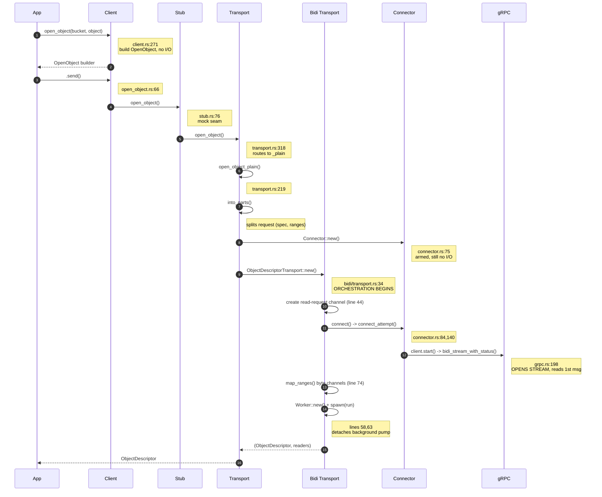
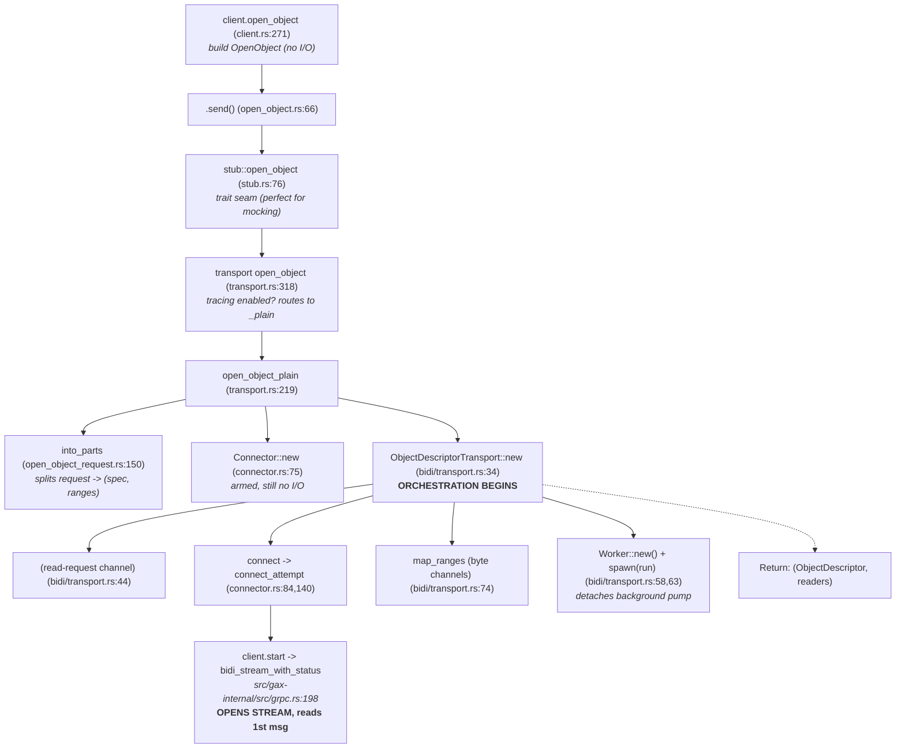

# `open_object` — A Walkthrough

*Last updated: 2026-05-27 (commit 30d28f9a5)*

This guide offers a walkthrough of `Storage::open_object` in the
`google-cloud-storage` crate. We'll look at what it actually does under the
hood, trace through each layer of the stack, see what remains running after the
call returns, and dive deep into reference sections for the trickier components.

All file paths here are relative to the `google-cloud-rust/` repository root,
and any line numbers correspond to the current state of the source code on disk.

## How This Document Was Created

This doc was written with AI assistance.

1. First, I used the following prompt to create an initial draft.

   > I want to understand `open_object`. Starting with a call to
   > `Client::open_object`, trace execution all the way until the function
   > returns. Pay particular attention to `src/storage/bidi` as that where I
   > believe the bulk of the code lies. Ground every citation by annotating
   > every code snippet and claim with file name and line numbers.

1. Next, I asked AI to teach the walkthrough by breaking it down into small,
   conversational chunks. This made it easier to digest the material, and also
   made the job of double checking and challenging the AI much easier. With the
   source code open beside me, I challenged the AI often, asking it to explain,
   substantiate, or revise its claims. Whenever I felt appropriate, I asked the
   AI to update the walkthrough doc with its updated understanding.

1. Once this was done and I had a reasonable understanding of `open_object`, I
   got the AI to clean up its work. I prompted it to clean up its bombastic
   language (e.g. "the spectacle of the `ActiveRead`s operating in perfect
   synchrony with the user-facing `ReadObjectResponse`s is truly a marvel to
   behold" became "the `ActiveRead`s push the newly received chunk of data to
   the corresponding `ReadObjectResponse`"), check its file sources/line
   numbers, tighten its prose, etc. This was done several times, clearing the
   context each iteration. Doing so halved the length of the document. I started
   each iteration with the prompt:

   > You are an expert in Rust, the google-cloud-rust repository, and a highly
   > skilled technical writer. Here is a document written to understand the
   > `open_object` flow. I suspect that it is poorly written and contains
   > numerous factual inaccuracies. Please read the document and 1. check every
   > single code citation, ensuring the line numbers and files are correct 2.
   > check whether the document accurately represents the flow. Please also
   > rewrite the document so that the language is clean, precise, and direct.
   > Prefer simple sentence structures and language.

   and then issued various prompts as I saw fit.

1. I naively assumed that correcting the AI in conversation would result in it
   saving the corrected knowledge to the document. I was wrong - human review of
   the final was still necessary. To make this task more manageable, the
   document was checked in piecemeal.

## Table of Contents

- [Mental Model: A Persistent Object Handle](#mental-model-a-persistent-object-handle)
- [Files Involved](#files-involved)
- [End-to-End Call Graph](#end-to-end-call-graph)
- [Part 1 - The Linear Execution Trace](#part-1---the-linear-execution-trace)
  - [1. `open_object()` Returns a Request Builder — Lazy, No I/O](#1-open_object-returns-a-request-builder-lazy-no-io)
  - [2. `.send()` / `.send_and_read()`](#2-send-send_and_read)
  - [3. The Stub Trait — The Mock Seam](#3-the-stub-trait-the-mock-seam)
  - [4. The Transport Routes on Tracing](#4-the-transport-routes-on-tracing)
  - [5. `open_object_plain` — Four Crucial Lines](#5-open_object_plain-four-crucial-lines)
  - [6. `into_parts` — Splitting the Request](#6-into_parts-splitting-the-request)
  - [7. `Connector::new` — Armed but Not Fired](#7-connectornew-armed-but-not-fired)
  - [8. `ObjectDescriptorTransport::new` — Orchestration (Part 1: Prep)](#8-objectdescriptortransportnew-orchestration-part-1-prep)
  - [9. `connect()` — The Retry and Self-Heal Loop](#9-connect-the-retry-and-self-heal-loop)
  - [10. `connect_attempt` — Establishing the Connection](#10-connect_attempt-establishing-the-connection)
  - [11. `ObjectDescriptorTransport::new` — Orchestration (Part 2)](#11-objectdescriptortransportnew-orchestration-part-2)
  - [12. The Climb Back Up](#12-the-climb-back-up)

## Mental Model: A Persistent Object Handle

`open_object` isn't a one-off "fetch data" request - it opens a **bidirectional
gRPC streaming RPC** (`google.storage.v2.Storage/BidiReadObject`) that enables
concurrent, repeated reads. When the user makes a single call to `open_object`,
here is what happens:

1. **Initiate the connection:** It establishes a single, long-lived
   bidirectional stream to Google Cloud Storage (GCS).
1. **Server responds with object metadata:** The server identifies itself, and
   the very first message it sends back contains the object's metadata.
1. **The stream stays open:** A background **`Worker` task** is spawned to own
   and manage the stream for its entire lifetime.
1. **The user gets a handle:** The user receives an `ObjectDescriptor`, which
   acts as the user's handle. The user can use it to request multiple
   byte-ranges over time, and all these requests are multiplexed over that
   single underlying stream.

In some ways this resembles a pre-cell phone era phone call:

| Metaphor                                     | Real Thing                                                         |
| -------------------------------------------- | ------------------------------------------------------------------ |
| The open line                                | The bidirectional gRPC stream                                      |
| The operator keeping it alive                | The spawned `Worker` task                                          |
| The user's handset wire to the operator      | The **read-request channel** (which carries `ActiveRead` requests) |
| A dedicated answer line per request          | The per-range **byte channels** (which carry `Result<Bytes>`)      |
| The operator's memory of who the user dialed | The `Arc<Mutex<BidiReadObjectSpec>>` (used for redials/reconnects) |
| The handle in the user's hand                | The `ObjectDescriptor`                                             |

By the time `open_object` returns, three distinct things are alive: the gRPC
stream itself, the detached worker task running in the background, and the
user's descriptor handle (which communicates with the worker over a channel).

## Files Involved

Here's a quick map of the relevant files and the layers they represent:

| Layer                                            | File                                                            |
| ------------------------------------------------ | --------------------------------------------------------------- |
| Public client & `open_object` method             | `src/storage/src/storage/client.rs`                             |
| `DefaultStorage` alias                           | `src/storage/src/lib.rs`                                        |
| Request builder (`OpenObject`)                   | `src/storage/src/storage/open_object.rs`                        |
| App request type & `into_parts`                  | `src/storage/src/model_ext/open_object_request.rs`              |
| Stub trait (mock seam)                           | `src/storage/src/storage/stub.rs`                               |
| Default implementation (routing & orchestration) | `src/storage/src/storage/transport.rs`                          |
| Public `ObjectDescriptor`                        | `src/storage/src/object_descriptor.rs`                          |
| Descriptor stub trait & dynamic bridge           | `src/storage/src/storage/bidi/stub.rs`                          |
| Connect and reconnect logic (the real RPC)       | `src/storage/src/storage/bidi/connector.rs`                     |
| Descriptor transport (orchestration)             | `src/storage/src/storage/bidi/transport.rs`                     |
| Background stream pump                           | `src/storage/src/storage/bidi/worker.rs`                        |
| Per-range read state                             | `src/storage/src/storage/bidi/active_read.rs`                   |
| Redirect handling                                | `src/storage/src/storage/bidi/redirect.rs`                      |
| `Client` trait / tonic glue                      | `src/storage/src/storage/bidi.rs`                               |
| Generic gRPC client                              | `src/gax-internal/src/grpc.rs`                                  |
| Generic retry loop                               | `src/gax/src/retry_loop_internal.rs`                            |
| Generated protobufs                              | `src/storage/src/generated/protos/storage/google.storage.v2.rs` |

## End-to-End Call Graph

Here is the high-level execution trace:

| Call Stack / Action                 | Location                           | Description                                   |
| :---------------------------------- | :--------------------------------- | :-------------------------------------------- |
| `client.open_object(b, o)`          | `client.rs:271`                    | build `OpenObject` (no I/O happens here)      |
| -> `.send()`                        | `open_object.rs:66`                | go async, call the stub                       |
| -> `stub::open_object`              | `stub.rs:76`                       | trait seam (perfect for mocking)              |
| -> `transport open_object`          | `transport.rs:318`                 | tracing enabled? -> routes to `_plain`        |
| -> `open_object_plain`              | `transport.rs:219`                 | `into_parts` + `Connector` + `Transport::new` |
| -> `into_parts`                     | `open_object_request.rs:150`       | splits request -> (spec, ranges)              |
| -> `Connector::new`                 | `connector.rs:75`                  | armed, still no I/O                           |
| -> `ObjectDescriptorTransport::new` | `bidi/transport.rs:34`             | **ORCHESTRATION BEGINS**                      |
| -> `(read-request channel)`         | `bidi/transport.rs:44`             |                                               |
| -> `connect` -> `connect_attempt`   | `connector.rs:84,140`              | OPENS STREAM, reads 1st msg                   |
| -> `client.start`                   | `bidi.Connector::connect`          |                                               |
| -> `bidi_stream_with_status`        | `src/gax-internal/src/grpc.rs:198` |                                               |
| -> `inner.streaming`                | `src/gax-internal/src/grpc.rs:223` | \<- tonic / hyper / h2 / socket               |
| -> `map_ranges`                     | `bidi/transport.rs:74`             | creates byte channels                         |
| -> `Worker::new` + `spawn(run)`     | `bidi/transport.rs:58,63`          | detaches background pump                      |
| \<- `(ObjectDescriptor, readers)`   |                                    | Return values                                 |

### Sequence Diagram



### Flowchart



# Part 1 - The Linear Execution Trace

Let's walk through the execution step-by-step.

## 1. `open_object()` Returns a Request Builder — Lazy, No I/O

We start in `client.rs:271`:

```rust
pub fn open_object<B, O>(&self, bucket: B, object: O) -> OpenObject<S>
```

The body of this function is just a single line at `:276`:
`OpenObject::new(self.stub.clone(), bucket, object, self.options.clone())`. It
clones `self.options` so that per-request overrides don't mutate the underlying
client.

Here's the definition of the `OpenObject` struct (`open_object.rs:43`):

```rust
pub struct OpenObject<S = crate::storage::transport::Storage> {
    stub: Arc<S>,
    request: OpenObjectRequest,
    options: RequestOptions,
}
```

(If you are wondering what `S` is, check out **Reference A**.)

The returned `OpenObject` is a request builder which provides the following
setters:

- **Request fields:**
  - `set_generation` (`:142`)
  - `set_if_generation_match` (`:162`)
  - `set_if_generation_not_match` (`:186`)
  - `set_if_metageneration_match` (`:209`)
  - `set_if_metageneration_not_match` (`:232`)
  - `set_key` (`:256`, used for CSEK)
- **Options:** behavior can be configured with:
  - `with_retry_policy` (`:284`)
  - `with_backoff_policy` (`:308`)
  - `with_retry_throttler` (`:338`)
  - `with_read_resume_policy` (`:365`)
  - `with_attempt_timeout` (`:396`, which defaults to 60s)
  - `with_user_agent` (`:415`)
  - `with_quota_project` (`:439`)

Up to this point, there has been zero network activity.

## 2. `.send()` / `.send_and_read()`

The action starts when the user invokes `send()` at `open_object.rs:66`:

```rust
pub async fn send(self) -> Result<ObjectDescriptor> {
    let (descriptor, _) = self.stub.open_object(self.request, self.options).await?;  // :67
    Ok(descriptor)                                                                   // :68
}
```

This method calls the stub—finally initiating network activity—and notably
**discards the `Vec<ReadObjectResponse>` readers** by using `_`.

There's also a sibling method, `send_and_read` (`:91`). This method pushes a
single range first (`:95`) and retains the single reader returned by the stub
(`:98`). It enforces that only one reader exists via `unreachable!` (`:102`).
This is the preferred path for an "open plus first read in a single round trip"
operation.

## 3. The Stub Trait — The Mock Seam

The `open_object` trait method called on the stub is defined in `stub.rs:76`:

```rust
fn open_object(&self, _request, _options)
    -> impl Future<Output = Result<(Descriptor, Vec<ReadObjectResponse>)>> + Send {
    unimplemented_stub::<(Descriptor, Vec<ReadObjectResponse>)>()   // :82 → :104 unimplemented!()
}
```

`self.stub` is typed as `Arc<S: stub::Storage>`. The stub is provided to make it
easier to provide a mock implementation for testing. (See **Reference A** for
more details.)

## 4. The Transport Routes on Tracing

The production trait implementation is located inside `transport.rs:318` (which
is part of `impl super::stub::Storage for Storage`, starting at `:267`):

```rust
async fn open_object(&self, request, options) -> Result<(...)> {
    if self.tracing { return self.open_object_tracing(request, options).await; }  // :323
    self.open_object_plain(request, options).await                                // :326
}
```

If tracing is enabled, `open_object_tracing` (`:231`) wraps the call. It sets up
a `client_request` span tagged with
`google.storage.v2.Storage/BidiStreamingRead` (`:245`), forwards to the `_plain`
variant, and wraps the resulting descriptor and readers with tracing decorators
(`:253–263`). For this walkthrough, we'll follow the `_plain` path.

> ⚠️ *A quick note on naming:* There are two structs named `Storage`. One is the
> **client** `Storage<S>` (`client.rs:92`), and the other is the **transport**
> `Storage` (`transport.rs:49`, which is aliased to `DefaultStorage`). Here,
> `self` refers to the transport.

## 5. `open_object_plain` — Four Crucial Lines

In `transport.rs:219`, the core logic boils down to four lines:

```rust
let (spec, ranges) = request.into_parts();                              // :224  decompose the request into request spec + desired ranges
let connector = Connector::new(spec, options, self.inner.grpc.clone()); // :225  specify the connection parameters
let (transport, readers) =
    ObjectDescriptorTransport::new(connector, ranges).await?;           // :226  establish the connection and send the initial RPC
Ok((ObjectDescriptor::new(transport), readers))                         // :227  wrap the I/O mechanism & return handles to the incoming byte streams
```

Line `:226` is where the network is finally touched.

(Note `self.inner.grpc` references the shared gRPC client attached to
`StorageInner`.)

## 6. `into_parts` — Splitting the Request

Looking at `open_object_request.rs:150`:

```rust
pub(crate) fn into_parts(mut self) -> (BidiReadObjectSpec, Vec<ReadRange>) {
    let ranges = std::mem::take(&mut self.ranges);   // :151
    (BidiReadObjectSpec::from(self), ranges)         // :152
}
```

`std::mem::take` swaps the `ranges` Vec out of the request with any empty Vec,
so that `self` remains whole. This allows `self` to be consumed by `From::from`
on the next line.

(`let ranges = self.ranges` would have resulted in a partial move of `self`,
preventing it from being passed into `BidiReadObjectSpec::from`.)

**Why do we split the request?** The `spec` represents the *connection identity
and conditions* (which are long-lived and resent on every reconnect). The
`ranges` represent the *work* (which is transient; more ranges can be added
later via `read_range`). Consequently, they are routed differently: `spec` goes
to the `Connector` (`:225`), while `ranges` go directly to the transport
(`:226`). This cleanly mirrors the protobuf wire format, where the request
message has distinct `read_object_spec` and `read_ranges` fields (see
**Reference C**).

## 7. `Connector::new` — Armed but Not Fired

In `connector.rs:75`, the connector wraps the `spec` in an `Arc<Mutex<...>>`
(`:77`), stores the options and client, and initializes `reconnect_attempts` to
`0` (`:80`). There's **no I/O** happening here. The struct definition (`:62`)
looks like this:

```rust
pub struct Connector<T = GrpcClient> {
    spec: Arc<Mutex<BidiReadObjectSpec>>,   // mutable, shared identity
    options: RequestOptions,
    client: T,                              // generic for mocking; real = gaxi GrpcClient
    reconnect_attempts: u32,
}
```

The connector's job is: *"Establishes (and reconnects) bidi streaming reads."*
(`:45`).

Handling reconnects inherently requires state. The connector must remember the
generation, read handle, routing token, and the number of attempt counts. We use
an `Arc<Mutex>` because the spec is **mutated** after creation (the server fills
in the generation, handle, and token) and must be **shared** across both the
connect retry loop and the worker's reconnect path.

## 8. `ObjectDescriptorTransport::new` — Orchestration (Part 1: Prep)

Moving to `bidi/transport.rs:34`, we do some prep work before establishing the
connection:

```rust
let (tx, rx) = tokio::sync::mpsc::channel(100);                    // :44  new read request channel
let requested_ranges = ranges.into_iter().map(|r| r.0).collect::<Vec<_>>(); // :45  unwrap newtype
let proto_ranges = requested_ranges.iter().enumerate()
    .map(|(id, r)| r.as_proto(id as i64)).collect::<Vec<_>>();              // :46–50  mint read-ids
```

- **Line `:44`** creates the **read-request channel** between the descriptor and
  the worker. The descriptor holds onto `tx`, while `rx` will be handed to the
  worker (`:63`). This channel carries new read requests (`ActiveRead`).
- **Lines `:46–50`** assign an index to each range, establishing its
  **read-id**. This identifier acts as the address used to reliably route
  responses back to the correct reader. (For a deep dive into all the channels,
  see **Reference D**.)

## 9. `connect()` — The Retry and Self-Heal Loop

Over in `connector.rs:84`, we find `connect()`. It's actually **a wrapper**
around the `connect_attempt` function, rather than the connect operation itself.

Inside, the `inner` closure (`:98`) calculates
`attempt_timeout = min(per-attempt, remaining-budget)` (fulfilling the promise
in the `with_attempt_timeout` docs, at `:99`) and wraps a single
`connect_attempt` in a `tokio::time::timeout`.

The process is driven by `retry_loop` (`:107`): it continuously attempts the
call as long as the retry policy permits, success hasn't been achieved, and the
throttler allows it, sleeping for the appropriate backoff duration between
attempts. The flag `idempotent` is set to `true` (`retry_loop_internal.rs:54`)
because opening a read is safely side-effect-free and retryable. Notably, **this
exact same `connect()` function is reused by the worker whenever a reconnect is
needed (`connector.rs:125`).**

## 10. `connect_attempt` — Establishing the Connection

In `connector.rs:140`, the actual connection is established in two phases.

**Phase A — Composing and sending the opening message:**

```rust
let request = BidiReadObjectRequest {
    read_object_spec: Some((*spec.lock()...).clone()),   // :147  snapshot the request spec
    read_ranges: ranges,                                 // :148
};
// :150–176  validate bucket is `projects/_/buckets/*`, else BindingError BEFORE any network
// :177–183  build x-goog-request-params = bucket=… (+ &routing_token=… if set)
let (tx, rx) = tokio::sync::mpsc::channel::<BidiReadObjectRequest>(100);  // :185  wire-out (mpsc)
tx.send(request.clone()).await...;                                       // :186  preload 1st msg
// :188–197  GrpcMethod + path /google.storage.v2.Storage/BidiReadObject
let response = client.start(extensions, path, rx, options, &X_GOOG_API_CLIENT_HEADER,
                            &x_goog_request_params).await?;              // :199  OPEN THE STREAM
```

Here, `client.start` (`bidi.rs:69`) takes `rx`, wraps it in a `ReceiverStream`,
and invokes `bidi_stream_with_status` (refer to **Reference E**).

Note that if a connection is successfully established, `read_object_spec` is
updated to contain the object's generation and RPC read handle
(`connector.rs:221-226`). `reconnect()` uses `connect()` under the hood, and so
`:147` ensures that any reconnect attempt uses this enriched information.

**Phase B — The Handshake:**

```rust
let response = match response { Ok(r) => r, Err(status) => return Err(handle_redirect(spec, status)) }; // :211
let (metadata, mut stream, _) = response.into_parts();   // :216  metadata=transport headers
let headers = metadata.into_headers();                   // :217
match stream.next_message().await {                      // :218  read the FIRST message
    Ok(Some(m)) => {
        let mut guard = spec.lock()...;                  // :220  ENRICH the spec:
        if let Some(g) = m.metadata.as_ref().map(|o| o.generation) { guard.generation = g; }  // :222
        if m.read_handle.is_some() { guard.read_handle = m.read_handle.clone(); }             // :225
        Ok((m, headers, Connection::new(tx, stream)))    // :227
    }
    Ok(None) => Err(Error::io("...closed before start")), // :229
    Err(status) => Err(handle_redirect(spec, status)),    // :230
}
```

It is required that the first message carries the object metadata (this is
strictly enforced in step 11). The writes at `:222` and `:225` represent the
**enrichment** phase. If the app initiated the request with `generation: 0`
(meaning "latest"), we capture the generation number returned by the server,
alongside the read handle to make future reconnects cheaper.

This block returns `(initial_response, headers, connection)`. This matches
exactly what `connect()` outputs, and what the `connector.connect(...)` call in
step 11 returns.

> *Clarification:* Don't confuse the two uses of the word "metadata" here. The
> first `metadata` that is turned `into_headers` represents the **transport**
> metadata (the gRPC response headers). On the other hand, `m.metadata` is the
> actual **object** metadata (the `Object` protobuf). See **Reference H** for
> details.

## 11. `ObjectDescriptorTransport::new` — Orchestration (Part 2)

Returning to `bidi/transport.rs:51`, armed with our
`(initial, headers, connection)`:

```rust
let (mut initial, headers, connection) = connector.connect(proto_ranges).await?;  // :51
let object = FromProto::cnv(initial.metadata.take().ok_or_else(|| {
    Error::deser("initial response in bidi read must contain object metadata") })?)...;  // :52–55
let object = Arc::new(object);                                                    // :56
let (active, readers) = Self::map_ranges(requested_ranges, &tx, &object);         // :57
let mut worker = super::worker::Worker::new(connector, active);                   // :58
worker.handle_response_success(initial).await.map_err(Error::io)?;                // :59–62
let _handle = tokio::spawn(worker.run(connection, rx));                           // :63
Ok((Self { object, headers, tx }, readers))                                       // :64–71
```

Let's break down this crucial block:

- **Lines `:52–56`:** We use `initial.metadata.take()` - the `Option` equivalent
  of `mem::take` - stealing the field while allowing `initial` to be reused at
  `:59`. We wrap the resulting `Object` in an `Arc` because it needs to be
  shared between the descriptor and every reader.
- **Line `:57`:** `map_ranges` (defined at `:74`, with the per-range channel
  created at `:82`) mints exactly one **byte channel per range**. This yields an
  `ActiveRead` (the sender side, kept by the worker) and a `RangeReader` wrapped
  as a `ReadObjectResponse` (the receiver side, handed to the user). See
  **Reference D** and **Reference G**.
- **Line `:58`:** We instantiate the worker. The `connector` is **moved in**
  here. Because the worker now completely owns the connector, it can freely call
  `connector.reconnect(...)` from within its detached task later on. Inside the
  worker, `active` is transformed into a `HashMap` mapping read ids to
  `ActiveRead`s (`worker.rs:38–43`).
- **Lines `:59–62`:** We immediately feed the worker the first message's
  `object_data_ranges`. This happens **synchronously**. For a standard `send()`,
  this might be a no-op, but for `send_and_read`, it delivers the very first
  chunk of data instantly.
- **Line `:63`:** The worker is handed off to be executed asynchronously via
  `tokio::spawn` and is completely **detached** (we deliberately drop the
  handle). It now has full ownership of the connection and will run its loop
  until the stream concludes naturally, an unrecoverable error strikes, or the
  descriptor's `tx` channel is dropped.
- **Lines `:64–71`:** Finally, we return the fully initialized transport
  (`object`, `headers`, `tx`) along with the `readers`.

## 12. The Climb Back Up

The call stack unwinds cleanly:

| Action                                                           | Location               | Description                                                |
| :--------------------------------------------------------------- | :--------------------- | :--------------------------------------------------------- |
| `ObjectDescriptorTransport::new` -> `(transport, readers)`       | `bidi/transport.rs:64` | Hands the established connection and range readers back up |
| `open_object_plain: ObjectDescriptor::new(transport)`            | `transport.rs:227`     | Wraps the transport stub into the public type              |
| `stub::open_object`                                              | `transport.rs:326`     | Hands the transport stub back up                           |
| **Either:** `.send()`: `let (descriptor, _) = …; Ok(descriptor)` | `open_object.rs:67`    | Discards the readers                                       |
| **Or:** `send_and_read()`                                        | `open_object.rs:98`    | Retains the descriptor plus the single reader              |

The user is now successfully holding an `ObjectDescriptor` (analogous to a file
descriptor) which allows reads on the object.
